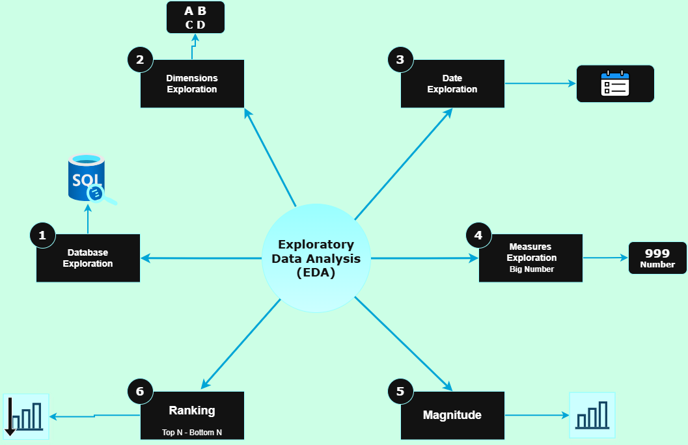
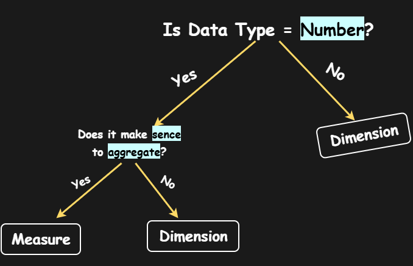
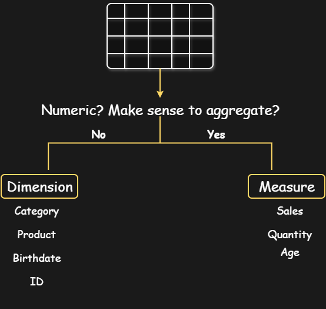
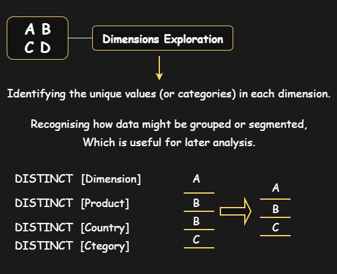
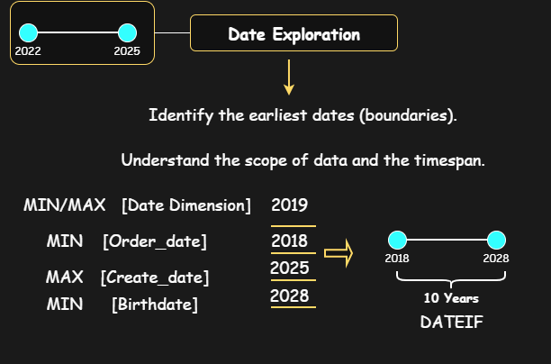
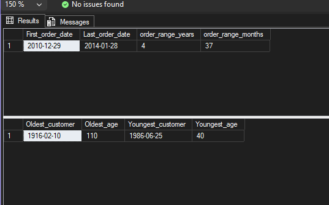
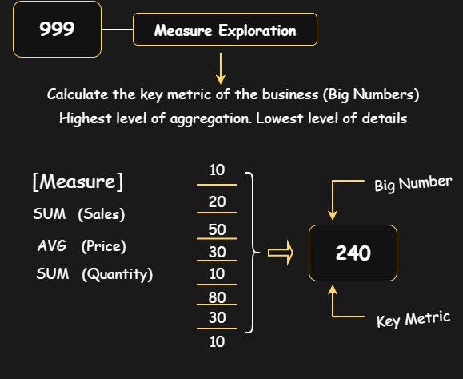
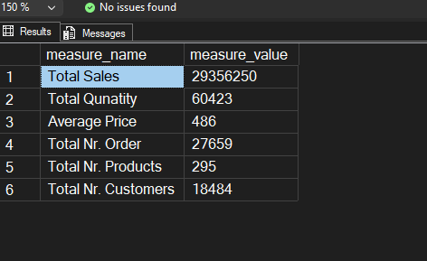
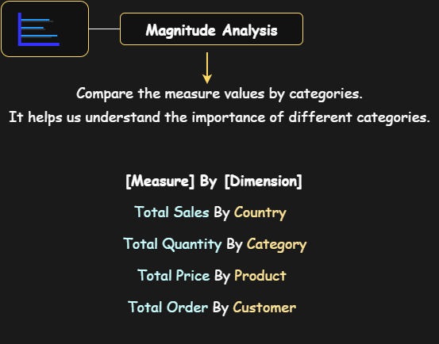

# sql_data_analytics_project
## 🚀 Exploratory_Data_Analysis_(EDA) Planning

This section outlines the advanced analytical techniques applied in this project to derive deeper insights beyond basic exploration.

This roadmap analytics layer focuses on analysing patterns, performance, and data distribution across time and segments. 
It enables deeper business insights through cumulative analysis, trend evaluation, performance measurement, and proportional analysis.

  

### The Secret Dimensions & Measures?
- That is a numeric value "YES", does it make sense to aggregate "YES" then it's Measure. If both conditions are false, then it's Dimension.

  

**Let's Check Column**
Here are few example column names

  

### 1. Analytics Components

**Database Exploration:**

  - **SQL TASK**
    
  1. Explore all objects in the Database
  2. Explore all columns in the Database

**SQL Implementation**
- [`01_database_exploration.sql`](scripts/01_database_exploration.sql)
  
### 2. Exploratory Data Analysis Dimensions Exploration

  

 - **SQL TASK**
    
  1. Explore all the countries our customers come from.
  2. Explore all products categories "The Major Divisions"

**SQL Implementation**
- [`02_dimensions_exploration.sql`](scripts/02_dimensions_exploration.sql)

### 3. Date Exploration

  

 - **SQL TASK**
    
  1. Determine the first and last order date
  2. How many years of sales are available?
  3. Find the youngest and oldest customers

**SQL Implementation**
- [`03_date_range_exploration.sql`](scripts/03_date_range_exploration.sql)

**SQL Table Results Screenshots**

  

### 4. Measures Exploration

  

 - **SQL TASK**
    
  1. Find the total sales
  2. Find how many items are sold
  3. Find the average selling price
  4. Find the total number of orders
  5. Find the total number of products
  6. Find the total number of customers
  7. Find the total number of customers who have placed an order
  8. Generate a report that shows all key metrics of the business

**SQL Implementation**
- [`04_measures_exploration.sql`](scripts/04_measures_exploration.sql)

**SQL Table Results Screenshots**

  

### 5. Magnitude Analysis

  

 - **SQL TASK**
    
  1. Find the total customers by countries
  2. Find total customers by gender
  3. Find total products by category
  4. What are the average costs in each category
  5. What is the total revenue generated for each category
  6. Find total revenue is generated by each customers
  7. What is the distribution of sold items across countries

**SQL Implementation**
- [`04_measures_exploration.sql`](scripts/04_measures_exploration.sql)

**SQL Table Results Screenshots**

  

- **Change Over Time (Trends):**  
  Analyse how key metrics evolve across time periods to identify growth patterns, seasonality, and anomalies.

- **Cumulative Analysis:**  
  Evaluate running totals and cumulative contributions to understand long-term impact and progression.

- **Performance Analysis:**  
  Compare actual values against benchmarks, targets, or prior periods to assess performance.

- **Part-to-Whole Analysis:**  
  Understand proportional contributions of categories to overall totals.

- **Data Segmentation:**  
  Break down data into meaningful groups to uncover hidden patterns and behavioural differences.

