# sql_data_analytics_project
## 🚀 Exploratory_Data_Analysis_(EDA) Planning

This section outlines the advanced analytical techniques applied in this project to derive deeper insights beyond basic exploration.

This roadmap analytics layer focuses on analysing patterns, performance, and data distribution across time and segments. 
It enables deeper business insights through cumulative analysis, trend evaluation, performance measurement, and proportional analysis.

  

### The Secret Dimensions & Measures?
- That is a numeric value "YES", does it make sense to aggregate "YES" then it's Measure. If both conditions are false, then it's Dimension.

  

**Let's Check Column**
Here are few example column names

  

### 1. Analytics Components

**Database Exploration:**

  - **SQL TASK**
    
  1. Explore all objects in the Database
  2. Explore all columns in the Database

**SQL Implementation**
- [`01_database_exploration.sql`](scripts/01_database_exploration.sql)
  
### 2. Exploratory Data Analysis Dimensions Exploration

  

 - **SQL TASK**
    
  1. Explore all the countries our customers come from.
  2. Explore all products categories "The Major Divisions"

**SQL Implementation**
- [`02_dimensions_exploration.sql`](scripts/02_dimensions_exploration.sql)

### 3. Date Exploration

  

 - **SQL TASK**
    
  1. Determine the first and last order date
  2. How many years of sales are available?
  3. Find the youngest and oldest customers

**SQL Implementation**
- [`03_date_range_exploration.sql`](scripts/03_date_range_exploration.sql)

**SQL Table Results Screenshots**

  

### 4. Measures Exploration

  

 - **SQL TASK**
    
  1. Find the total sales
  2. Find how many items are sold
  3. Find the average selling price
  4. Find the total number of orders
  5. Find the total number of products
  6. Find the total number of customers
  7. Find the total number of customers who have placed an order
  8. Generate a report that shows all key metrics of the business

**SQL Implementation**
- [`04_measures_exploration.sql`](scripts/04_measures_exploration.sql)

**SQL Table Results Screenshots**

  

### 5. Magnitude Analysis

  

 - **SQL TASK**
    
  1. Find the total customers by countries
  2. Find total customers by gender
  3. Find total products by category
  4. What are the average costs in each category
  5. What is the total revenue generated for each category
  6. Find each customer's total revenue
  7. What is the distribution of sold items across countries

**SQL Implementation**
- [`05_magnitude_analysis.sql`](scripts/05_magnitude_analysis.sql)

**SQL Table Results Screenshots**

  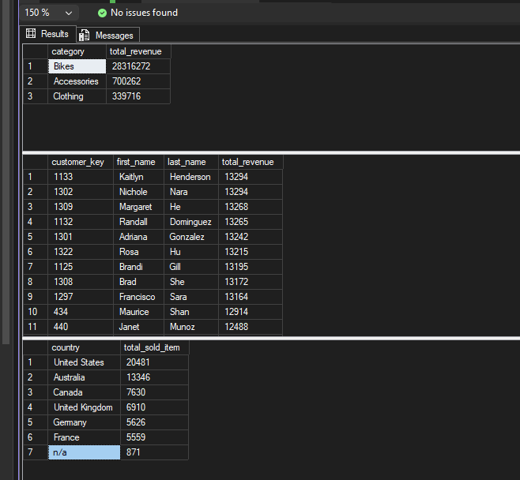

### 6. Ranking Analysis

  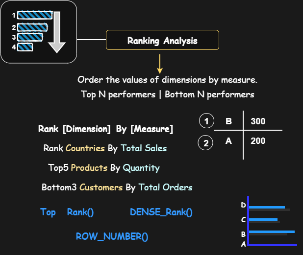

 - **SQL TASK**
    
  1. Which 5 Products generate the highest revenue
  2. What are the 5 worst-performing products in terms of sales?
  3. Find the top 10 customers who have generated the highest revenue
  4. The 3 customers with the fewest orders placed

**SQL Implementation**
- [`06_ranking_analysis.sql`](scripts/06_ranking_analysis.sql)

**SQL Table Results Screenshots**

  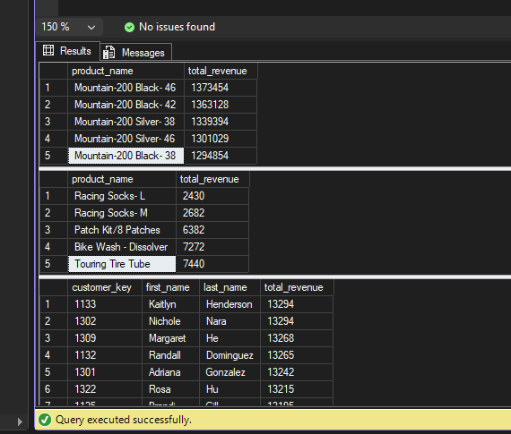

## 🚀 Advance_Analytics Planning

This section outlines the advanced analytical techniques applied in this project to move beyond basic data exploration and uncover deeper business insights.

The advanced analytics layer focuses on evaluating patterns, performance, and data distribution across time, categories, and segments. It transforms raw data into meaningful metrics that support strategic decision-making.

  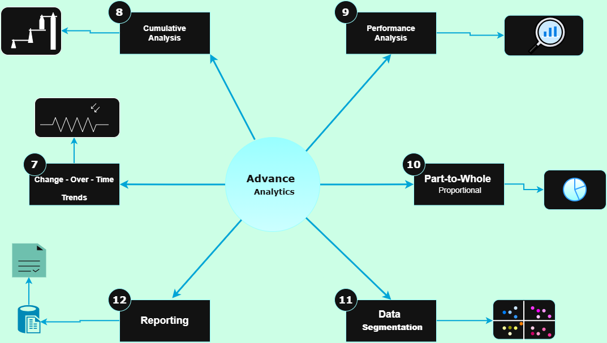

### 7. Change Over Time Analysis

  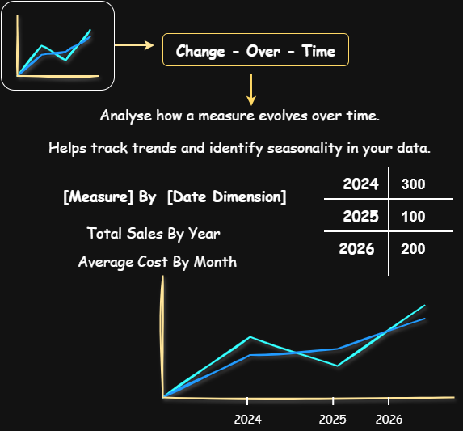

 - **SQL TASK**
    
  1. Analyse sales performance over time
  2. Quick Date Functions
  3. Analyse sales performance over the year
  4. Analyse sales performance over the month
  5. Analyse sales performance over the year & month
  6. Analyse sales performance over the year & month (Format)
  7. Analyse sales performance over the year & month (Using DATETRUNC)

**SQL Implementation**
- [`07_change_over_time_analysis.sql`](scripts/07_change_over_time_analysis.sql)

**SQL Table Results Screenshots**

  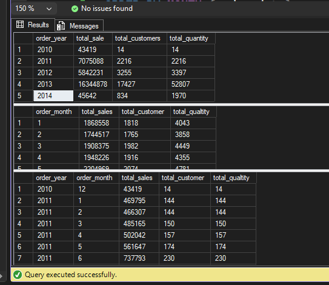

### 8. Cumulative Analysis

  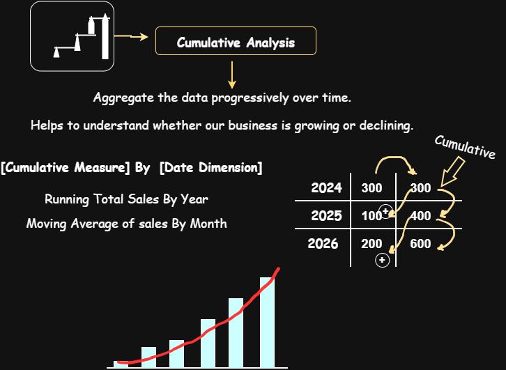

 - **SQL TASK**
    
  1. Monthly total sales with cumulative total
  2.  Monthly sales with partitioned running total (per month)
  3. Yearly total sales with cumulative total
  4. Yearly sales with cumulative total and moving average

**SQL Implementation**
- [`08_cumulative_analysis.sql`](scripts/08_cumulative_analysis.sql)

**SQL Table Results Screenshots**

  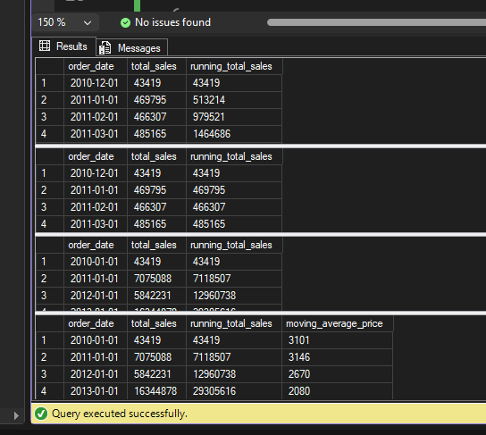

### 9. Performance Analysis

  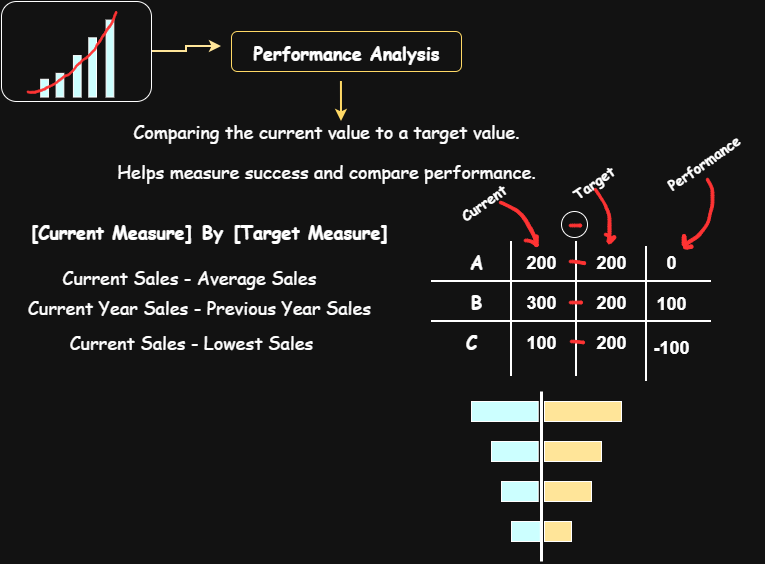

 - **SQL TASK**
    
  1. YEARLY PRODUCT PERFORMANCE (Year-over-Year Analysis)
  2. Historical average sales per product (across all years)
  3. Previous year's sales for YoY comparison
  4. MONTHLY PRODUCT PERFORMANCE (Month-over-Month Analysis)
  5. Historical monthly average per product
  6. Previous month's sales within same product

**SQL Implementation**
- [`09_performance_analysis.sql`](scripts/09_performance_analysis.sql)

**SQL Table Results Screenshots**

  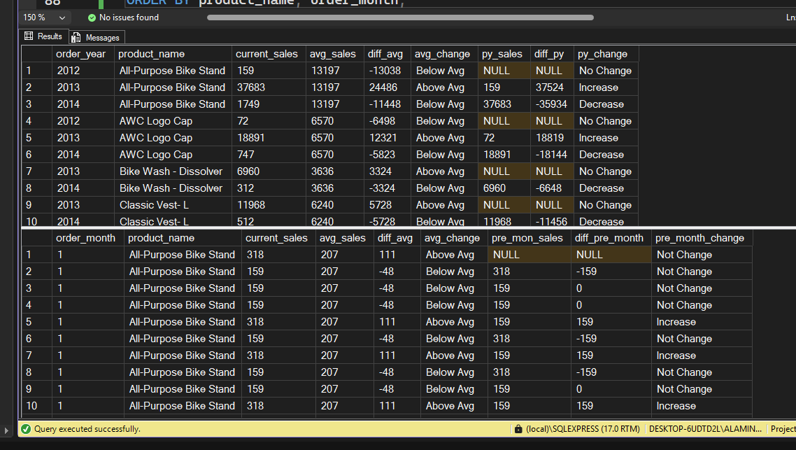

### 10. Part-To-Whole Analysis

  

 - **SQL TASK**
    
  1. Identify how much each category contributes to total company sales
  2. Overall company sales (same value repeated for each row)
  3. Percentage contribution of each category to overall sales
  4. Highest contributing categories first

**SQL Implementation**
- [`10_data_segmentation.sql`](scripts/10_part_to_whole_analysis.sql)

**SQL Table Results Screenshots**

  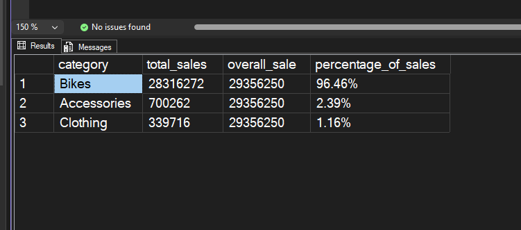

